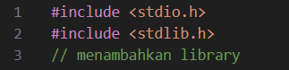
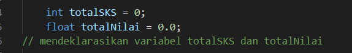
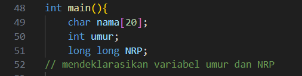
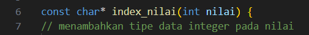
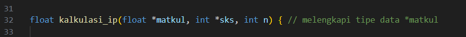
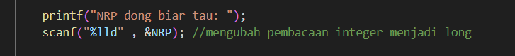
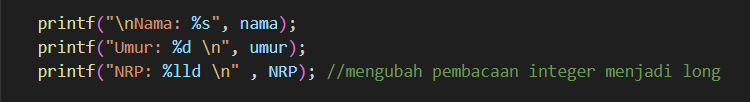
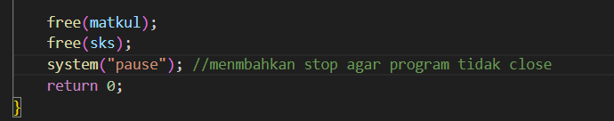

# Report P1
### Berikut merupakan perubahan yang saya lakukan
---
- melengkapi library yang kurang

---
- menambahkan deklarasi variabel

---
- melengkapi tipe data yang kurang

---
- mengubah pembacaan input output dari integer ke long (karena integer hanya support 2^32 bit)

---
- menmbahkan stop agar program tidak close

---