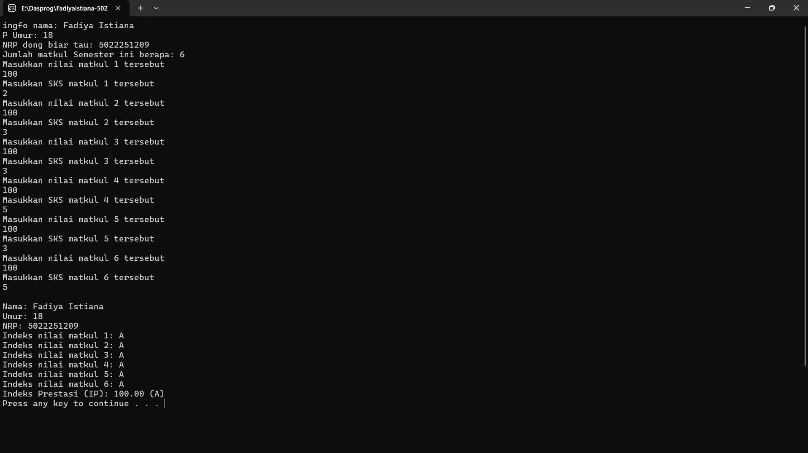

# Report P1
### Berikut merupakan perubahan yang saya lakukan

---

#### 1. Melengkapi library yang kurang

---

#### 2. Menambahkan deklarasi variabel
  

---

#### 3. Melengkapi tipe data yang kurang
  

---

#### 4. Mengubah pembacaan input output dari integer ke long  
(karena integer hanya support 2^32 bit)  
  

---

#### 5. Menambahkan stop agar program tidak close

---

### Output saat dijalankan

---
